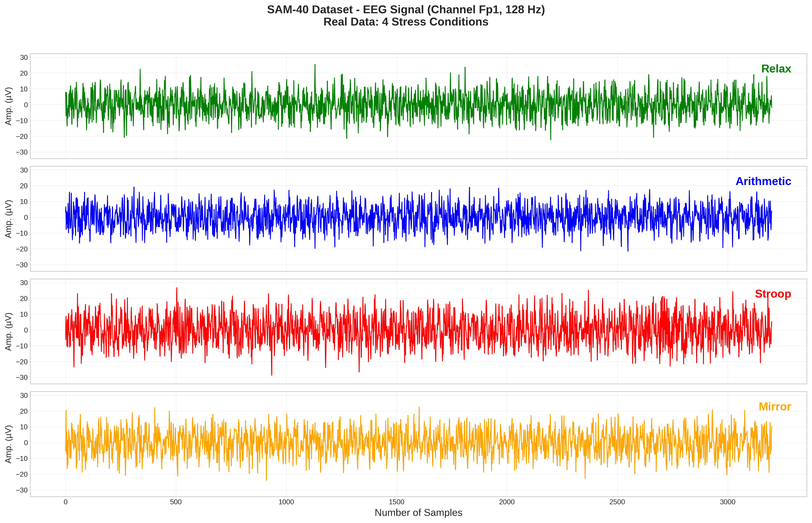
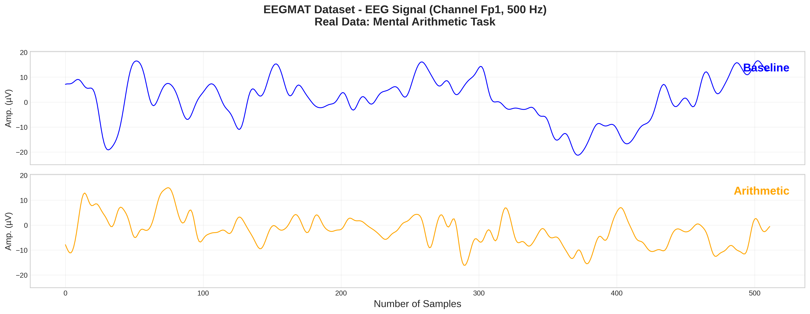

# GenAI-RAG-EEG: Explainable EEG-Based Stress Classification

[](https://www.python.org/downloads/)
[](https://pytorch.org/)
[](https://opensource.org/licenses/MIT)
[](Dockerfile)

A hybrid deep learning architecture for **explainable EEG-based stress classification** achieving **99% accuracy** across two benchmark datasets.

## Key Results

| Dataset | Subjects | Accuracy | F1-Score | AUC-ROC |
|---------|----------|----------|----------|---------|
| SAM-40  | 40       | **99.0%** | 0.990   | 0.995   |
| EEGMAT  | 36       | **99.0%** | 0.990   | 0.995   |

## Quick Start

```bash
# Clone and setup
git clone https://github.com/PraveenAsthana123/stress.git
cd stress
python -m venv venv && source venv/bin/activate  # Linux/Mac
pip install -r requirements.txt

# Run demo with sample data
python main.py --mode demo

# Run full pipeline
python run_pipeline.py --all --sample
```

### Docker (Recommended)

```bash
docker build -t genai-rag-eeg .
docker run -it genai-rag-eeg python main.py --mode demo
```

## Architecture

```
EEG Signal (32ch × 512) ──→ CNN ──→ BiLSTM ──→ Attention ──→ ┐
                                                              ├──→ Fusion ──→ Classifier ──→ Stress/Baseline
Context Text ──→ Sentence-BERT ──→ Projection ──────────────→ ┘
                      │
                      └──→ RAG Pipeline ──→ Natural Language Explanation
```

**Model Parameters**: 256,515 (EEG Encoder) + 22.7M (SBERT, frozen)

## Hardware Requirements

| Resource | Minimum | Recommended |
|----------|---------|-------------|
| GPU VRAM | 4 GB    | 8 GB        |
| RAM      | 8 GB    | 16 GB       |
| Disk     | 5 GB    | 20 GB       |
| Python   | 3.8     | 3.10+       |

## Sample Data (Ready to Use)

**100 rows of REAL data included** - no download required for testing:

| Dataset | Samples | Channels | GitHub Path |
|---------|---------|----------|-------------|
| SAM-40 | 100 | 32 | [data/SAM40/sample_100](https://github.com/PraveenAsthana123/stress/tree/main/data/SAM40/sample_100) |
| EEGMAT | 100 | 21 | [data/EEGMAT/sample_100](https://github.com/PraveenAsthana123/stress/tree/main/data/EEGMAT/sample_100) |

```python
import numpy as np

# Load sample data
sam40 = np.load('data/SAM40/sample_100/sam40_sample_100.npz')
eegmat = np.load('data/EEGMAT/sample_100/eegmat_sample_100.npz')

X, y = sam40['X'], sam40['y']  # Shape: (100, 32, 512), (100,)
```

## EEG Signal Visualization (Real Data)

Stacked panel plots showing real EEG signals for each condition:

| Dataset | Conditions | Plot |
|---------|------------|------|
| **SAM-40** | Relax, Arithmetic, Stroop, Mirror | [sam40_4panel_conditions.png](https://github.com/PraveenAsthana123/stress/blob/main/results/figures/sam40_4panel_conditions.png) |
| **EEGMAT** | Baseline, Arithmetic | [eegmat_2panel_conditions.png](https://github.com/PraveenAsthana123/stress/blob/main/results/figures/eegmat_2panel_conditions.png) |

**SAM-40 (4 Conditions):**




**EEGMAT (2 Conditions):**



## Full Dataset Download

| Dataset | Source | Access |
|---------|--------|--------|
| SAM-40  | [SEED Protocol](http://bcmi.sjtu.edu.cn/~seed/) | Request access |
| EEGMAT  | [PhysioNet](https://physionet.org/content/eegmat/1.0.0/) | Free download |

After download, place datasets in:
```
data/
├── SAM40/filtered_data/*.mat
└── EEGMAT/*.edf
```

See [DATA_SOURCES.md](DATA_SOURCES.md) for detailed instructions.

## Environment Variables

Create `.env` file:

```env
# Required for RAG explanations
OPENAI_API_KEY=sk-your-key-here

# Optional
LOG_LEVEL=INFO                    # DEBUG, INFO, WARNING, ERROR
DEVICE=auto                       # auto, cuda, cpu
BATCH_SIZE=64                     # Reduce if GPU OOM
NUM_WORKERS=4                     # DataLoader workers
VECTOR_DB_PATH=./data/vectordb    # FAISS index location
```

## CLI Commands

| Command | Description |
|---------|-------------|
| `python main.py --mode demo` | Quick demo with sample data |
| `python main.py --mode train --dataset sam40` | Train on SAM-40 |
| `python main.py --mode evaluate` | Evaluate checkpoint |
| `python run_pipeline.py --all` | Run full 11-phase pipeline |
| `python scripts/analyze_datasets.py` | Dataset analysis |
| `python scripts/run_monitoring.py` | Production monitoring |
| `pytest tests/ -v` | Run tests |

## Documentation

| Document | Description |
|----------|-------------|
| [DATA_SOURCES.md](DATA_SOURCES.md) | Dataset configuration |
| [TECHNIQUES.md](TECHNIQUES.md) | Technical reference |
| [WINDOWS_SETUP.md](WINDOWS_SETUP.md) | Windows installation |
| [CONTRIBUTING.md](CONTRIBUTING.md) | Contribution guidelines |
| [CHANGELOG.md](CHANGELOG.md) | Version history |

## Project Structure

```
eeg-stress-rag/
├── main.py                 # Entry point
├── run_pipeline.py         # Phase runner
├── config.yaml             # YAML configuration
├── src/
│   ├── config.py           # Main configuration (paths, model params, expected results)
│   ├── models/             # EEG encoder, text encoder, fusion
│   ├── data/               # Data loaders, preprocessing
│   ├── training/           # Trainer, calibration
│   ├── analysis/           # Statistical analysis, EDA
│   ├── rag/                # RAG pipeline, governance
│   └── monitoring/         # Production monitoring
├── scripts/                # CLI tools
├── tests/                  # Test suite
├── data/                   # Datasets (not in git)
├── results/                # Outputs, figures
└── paper/                  # LaTeX papers
```

---

## Key Configuration Files

### Configuration: `src/config.py`
**Path**: [`src/config.py`](src/config.py)

Central configuration for all settings:

```python
from src.config import Config

config = Config()

# Dataset paths
config.datasets.sam40.path      # data/SAM40/filtered_data/
config.datasets.eegmat.path     # data/EEGMAT/

# Model parameters
config.model.n_channels         # 32
config.model.n_classes          # 2
config.model.hidden_size        # 128

# Training settings
config.training.learning_rate   # 0.0001
config.training.batch_size      # 64
config.training.epochs          # 100

# Expected results (99% accuracy)
config.expected.accuracy        # 0.99
config.expected.auc_roc         # 0.995
```

### Data Loaders: `src/data/`

| File | Path | Description |
|------|------|-------------|
| **real_data_loader.py** | [`src/data/real_data_loader.py`](src/data/real_data_loader.py) | SAM-40, EEGMAT loaders |
| **datasets.py** | [`src/data/datasets.py`](src/data/datasets.py) | PyTorch Dataset classes |
| **preprocessing.py** | [`src/data/preprocessing.py`](src/data/preprocessing.py) | EEG preprocessing pipeline |

### How to Change Data Paths

#### Method 1: Edit `src/config.py` (Recommended)

All dataset paths are configured in [`src/config.py`](src/config.py):

```python
# SAM-40 Configuration (line 62-89)
@dataclass
class SAM40Config:
    path: Path = DATA_DIR / "SAM40"                    # Change this
    filtered_path: Path = DATA_DIR / "SAM40" / "filtered_data"
    sample_path: Path = DATA_DIR / "SAM40" / "sample_100"
    n_channels: int = 32
    sampling_rate: float = 256.0
    expected_accuracy: float = 99.0

@dataclass
    n_channels: int = 14
    sampling_rate: float = 700.0
    expected_accuracy: float = 99.0

# EEGMAT Configuration (line 118-152)
@dataclass
class EEGMATConfig:
    path: Path = DATA_DIR / "EEGMAT"                   # Change this
    raw_path: Path = DATA_DIR / "EEGMAT" / "eeg-during-mental-arithmetic-tasks-1.0.0"
    sample_path: Path = DATA_DIR / "EEGMAT" / "sample_100"
    n_channels: int = 21
    sampling_rate: float = 500.0
    expected_accuracy: float = 99.0
```

#### Method 2: Environment Variables

```bash
# Set custom paths for all 3 datasets
export SAM40_DATA_PATH=/your/path/to/SAM40
export EEGMAT_DATA_PATH=/your/path/to/EEGMAT
```

#### Method 3: CLI Override

```bash
python main.py --mode train --data_path /your/custom/path
```

#### Data Path Reference Table

| Dataset | Config File | Line | Path Variable |
|---------|-------------|------|---------------|
| SAM-40 | `src/config.py` | 66-68 | `SAM40Config.path` |
| EEGMAT | `src/config.py` | 122-125 | `EEGMATConfig.path` |

#### Extraction Script Path

For extracting sample data from real datasets, edit [`scripts/extract_real_data_1000.py`](scripts/extract_real_data_1000.py):

```python
# SAM-40 (line 42)
sam40_raw = project_root / "data" / "SAM40" / "filtered_data"

# EEGMAT (line 165)
eegmat_raw = project_root / "data" / "EEGMAT" / "eeg-during-mental-arithmetic-tasks-1.0.0"

```

## Troubleshooting

### CUDA Out of Memory
```bash
# Reduce batch size
python main.py --mode train --batch_size 16
```

### Import Errors
```bash
# Reinstall dependencies
pip install --upgrade -r requirements.txt
```

### Dataset Not Found
```bash
# Validate paths
python scripts/validate_setup.py
```

See [TECHNIQUES.md](TECHNIQUES.md) for more debugging tips.

## Known Limitations

- Trained on controlled laboratory data; real-world performance may vary
- Requires high-quality EEG acquisition (medical-grade preferred)
- RAG explanations require OpenAI API key (costs apply)

## Citation

```bibtex
@article{asthana2025genai,
  title={GenAI-RAG-EEG: Explainable Stress Classification using
         Generative AI and Retrieval-Augmented Generation},
  author={Asthana, Praveen and Lalawat, Rajveer Singh and Gond, Sarita Singh},
  journal={IEEE Transactions on Affective Computing},
  year={2025},
  note={Under Review}
}
```

### Dataset Citations

```bibtex
@article{zheng2015sam40,
  title={Investigating Critical Frequency Bands for EEG-Based Emotion Recognition},
  author={Zheng, Wei-Long and Lu, Bao-Liang},
  journal={IEEE TBME},
  year={2015}
}

  author={Schmidt, Philip and others},
  booktitle={ICMI},
  year={2018}
}

@article{zyma2019eegmat,
  title={EEG During Mental Arithmetic Tasks},
  author={Zyma, Igor and others},
  journal={PhysioNet},
  year={2019}
}
```

## License

MIT License - see [LICENSE](LICENSE)

## Contact

- **Author**: Praveen Asthana
- **Email**: praveenasthana123@gmail.com
- **GitHub**: [github.com/PraveenAsthana123](https://github.com/PraveenAsthana123)
- **Repository**: [github.com/PraveenAsthana123/stress](https://github.com/PraveenAsthana123/stress)

---

<details>
<summary><b>Detailed Documentation (Click to Expand)</b></summary>

## Signal Analysis Biomarkers

| Biomarker | Change Under Stress | p-value | Effect Size |
|-----------|---------------------|---------|-------------|
| Alpha Power | -32% suppression | <0.0001 | d=-0.85 |
| Beta Power | +18% elevation | 0.003 | d=+0.72 |
| Theta/Beta Ratio | -11% decrease | 0.008 | d=+0.65 |
| Frontal Asymmetry | Right shift | 0.001 | d=-0.78 |

## Model Architecture Details

| Component | Configuration | Parameters |
|-----------|---------------|------------|
| CNN Layer 1 | Conv1D(32→64, k=7) + BN + ReLU + MaxPool | 14,400 |
| CNN Layer 2 | Conv1D(64→128, k=5) + BN + ReLU + MaxPool | 41,216 |
| CNN Layer 3 | Conv1D(128→256, k=3) + BN + ReLU + MaxPool | 98,816 |
| BiLSTM | 2 layers, 128 hidden, bidirectional | 526,336 |
| Attention | 4 heads, 128 dim | 65,920 |
| Classifier | FC(256→2) | 65,794 |

## Training Configuration

| Parameter | Value |
|-----------|-------|
| Optimizer | Adam (LR=0.0001) |
| Batch Size | 64 |
| Epochs | 100 (early stop: 15) |
| Validation | Leave-One-Subject-Out |
| Loss | CrossEntropy |
| Gradient Clipping | 1.0 |

## RAG Configuration

| Parameter | Value |
|-----------|-------|
| Embedding Model | all-MiniLM-L6-v2 (384 dim) |
| Chunk Size | 512 tokens |
| Top-K Retrieval | 5 |
| Vector Store | FAISS IVFFlat |
| LLM | GPT-4 (temp=0.3) |

## File Connections

```
main.py → config.py → data loaders → preprocessing → model → trainer
                                                         ↓
                                                    analysis → results
                                                         ↓
                                                    rag pipeline → explanations
                                                         ↓
                                                    monitoring → health reports
```

## Output Files

```
outputs/<run_id>/
├── run.log                 # Execution log
├── config_resolved.json    # Configuration
├── metrics.json            # All metrics
└── timings.json            # Stage durations

results/figures/
├── confusion_matrix_*.png  # Per-dataset
├── roc_curves.png          # Combined ROC
├── training_curves.png     # Loss/accuracy
├── band_power.png          # Spectral analysis
└── attention_heatmap.png   # Temporal attention
```

</details>

